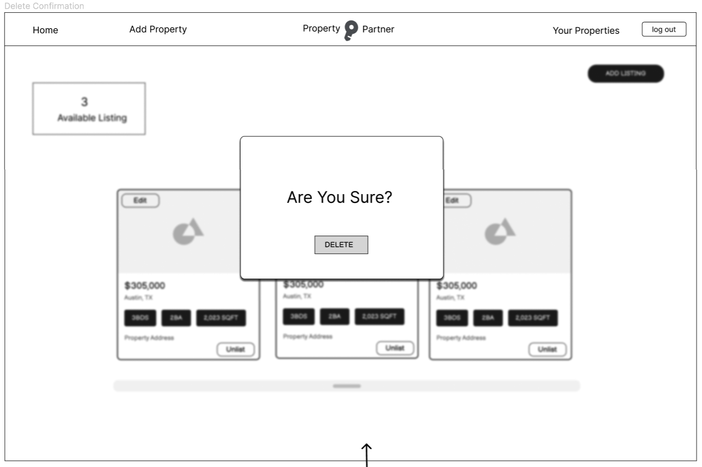

# Property Partner Graphical Interface

Property partner's front end is a single page web application engineered using React and Redux RTK query. This web app provides users with an intuitive graphical interface to browse properties available for purchase and also enables sellers to list properties they wish to sell.

## Landing Page

Property Partner's Landing page shows all properties currently listed for sale. There is a search bar that allow users to search properties by state or city as well as a side bar that offers the ability to further filter properties by price, square footage, number of beds, numbers of baths, and other features (multistory vs single-story and old-build vs new-build)

- Only logged in users will have access to the "Add Property Form" and their "User Dashboard".
- Users that are not logged in have the ability to sign up or log in. They do not have access the add property feature or a user dashboard.

## Property Detail Page

Each listed property card can be clicked on from the homepage to generate the property specific detail page. The property's detail page contains property images, property details, and the contact information of the property lister.

## Sign Up Form

Users who chooses to sign up will be presented with a form that requires them to input a **unique** username and email address to successfully create an account.

## Login

Property's Partner login form is implemented using a Bootstrap modal. Users must correctly input a valid username and password pair to successfully log in.

## User Dashboard

The user dashboard is only accessible to authenticated users, offering them a space to manage all their listed properties. Users has the ability to view all their listed properties, list a new property, as well as un-list and edit each of their existing property.

## Creating | Editing | Deleting Property Listing

- **Create Property**: This feature is only accessible by authenticated users. Users who wishes to list a property will be presented with a Add property form that allows them to insert details and images regarding their property. After creation, their property will be displayed in the landing page.

- **Edit Property**: This feature is accessible in the user dashboard. Only users that created a property listing will be able to edit the property. The edit property form will be pre-populated with current property data. Within the form, the authenticated user can update their property details as well as add and delete the property images.

- **Delete Property**: Users wishing to delete one of their existing property will be presented with a delete confirmation modal.

